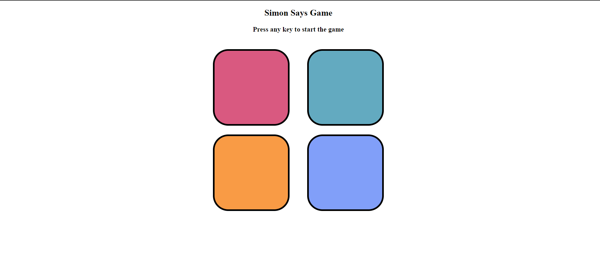

# Simon Game

This is a simple Simon game built using **Node.js**, **Express**, **EJS**, **CSS**, and **JavaScript**.

## Project Structure

- **app.js**: The main server file that sets up the Express application and serves the game page.
- **views/simon.ejs**: The EJS template that serves as the main HTML structure for the game.
- **public/style.css**: The CSS file that defines the visual styling of the game.
- **public/script.js**: The JavaScript file that implements the game logic.

## How to Play

1. **Start the Game**: Press any key on your keyboard to begin.
2. **Watch the Sequence**: Colored buttons will flash in a random sequence.
3. **Repeat the Sequence**: Click on the buttons in the same order that they flashed.
4. **Progress through Levels**: With each correct sequence, you will advance to a new level where an additional button is added to the sequence.
5. **Game Over**: If you click the wrong button, the game ends. Your score will be displayed, and you can compare it with your highest score stored in the browser's local storage.
6. **Restart the Game**: After a game over, press any key to restart.

## Screenshots

Here's a snapshot of website:




## Prerequisites

Ensure you have **Node.js** and **npm** installed on your machine.

## Installation

1. Clone the repository or download the project files.
2. Navigate to the project directory.
3. Install the necessary packages by running:
   ```bash
   npm install
